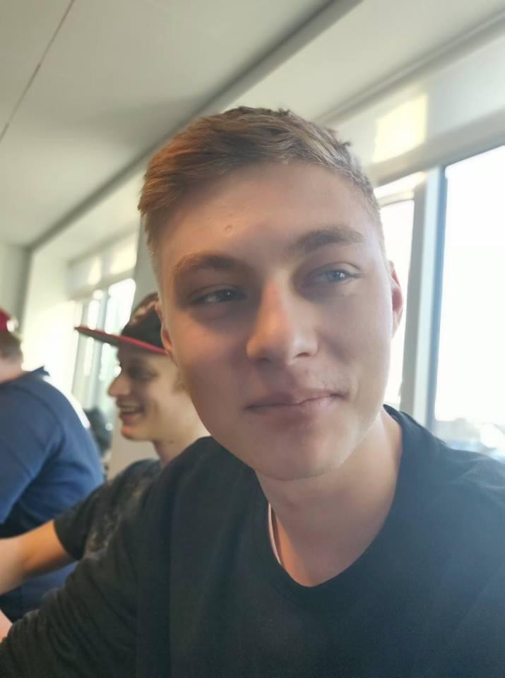
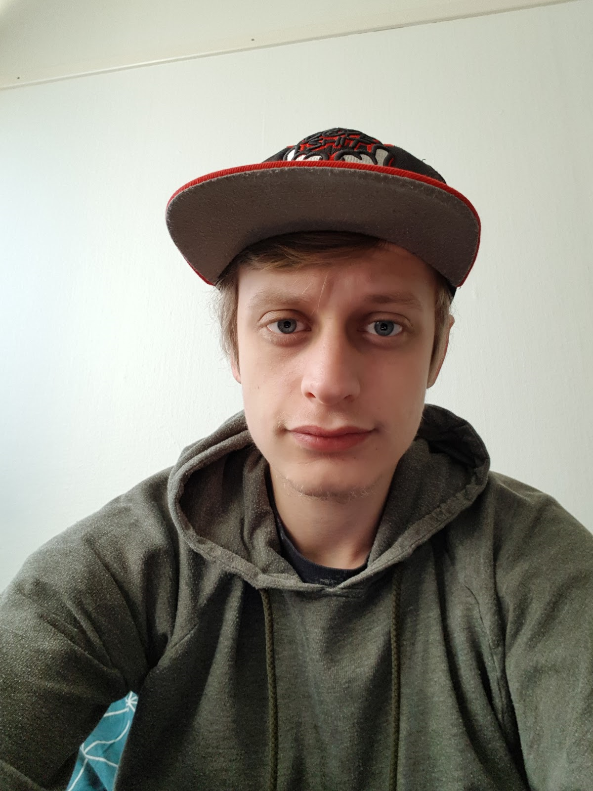
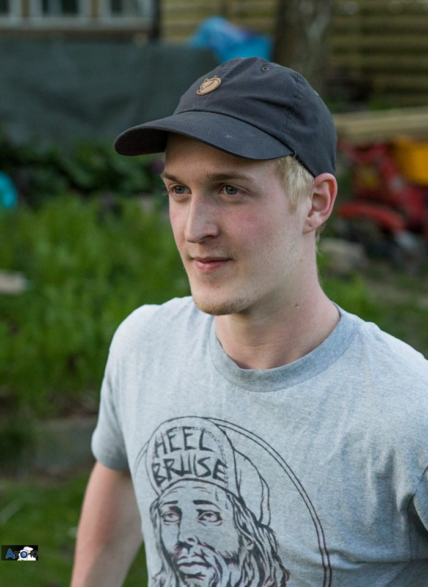

## Uge 1

### Gruppe 5 - MMRS - Rød
  
**Magnus Klitmose:** _Magmose_  
  
  
**Mathias Kristensen:** _mathiasbk1_
  
  
**Simon Bojesen:** _SimonBojesen_  
  
  
**Rasmus Jacobsen:** _RasmusLynge_  
  
  
### Gruppe Code of Conduct:
- Communicate openly
- Share issues with the team
- Use consensus for team decisions
- Actively participate in meetings
- The group will comunicate through messenger group and discord for meetings 
- Be present and engaged. You are expected to make a full and fair contribution to the work of the group
- Treat other members of the group with courtesy and respect their opinions, even if you do not necessarily agree with them
- When you agree to undertake a task that has been assigned to you by the group you must try work to the agreed deadline.
- It is your responsibility to attend all meetings arranged by the group to advance the project, and to arrive at those meetings on time. (5-10 min late is ok)
- If you can’t attend a meeting of the group you should consider providing your input in written form and giving this to the other group members before the meeting
- Hvis man ikke har været klar til mandags-review (hvis man ikke har lavet opgaver mm.) skal man give et sæt til hele holdet på den lokale.
   
   
  
### Formatering:
- I gruppen har vi valgt at bruge netbeans egen formatering (Alt-Shift-F)
- Navngivning følger [Javas style guidelines](https://google.github.io/styleguide/javaguide.html) 
- Javadoc skal kun skrives til public metoder og ikke til getters og setters
   
   
  
### Versionering:
I gruppen har vi valgt at bruge følgene versioner:
- Netbeans 8.2
- JDK 1.8
- SQL 5.7.21
- Maven 3.6.0
  
 ### Uge 1 Agenda:
 - Udarbejdet på discord
 
 ### Konflikter i gruppen:
 - Hvis det er problemer i gruppen, sætter vi tid af til at snakke sammen alle 4
 
 ### Finans til outsourcing:
 - Alle regner med at have pengene klar til dette
